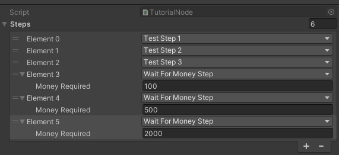
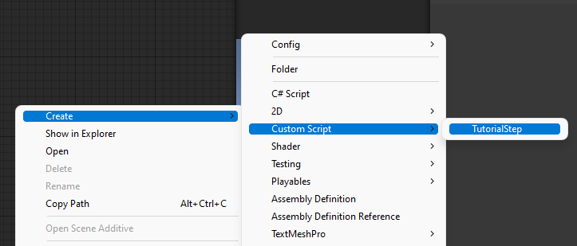
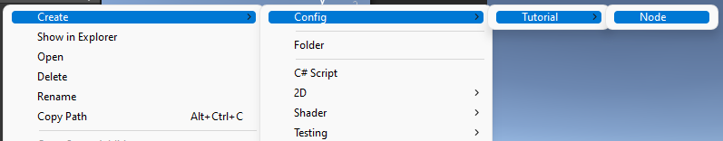
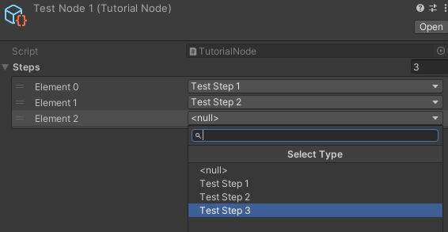
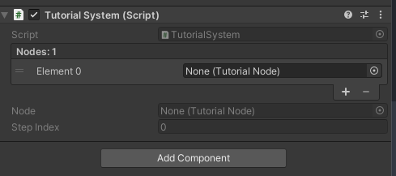
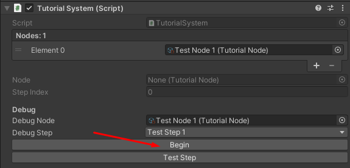
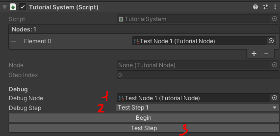

# Tutorial system
## Установка
Установите [Unitypackage](Snippets.Tutorial.unitypackage) в свой проект.

## Зависимости
Для нормальной работы пакета вам необходимо установить следующие зависимости:

[Serialize Reference Extenstion](https://github.com/mackysoft/Unity-SerializeReferenceExtensions) (Обязательно, есть в шаблоне проекта)

[Naughty Attributes](https://github.com/dbrizov/NaughtyAttributes) (Обязательно, есть в шаблоне проекта)

Все эти пакеты могут быть установлены через package manager, так что не будут засорять вам проект.

## Словарик
### Tutorial Step
Конкретный шаг обучения. Например, игроку нужно накопить 10.000 монет.
### Tutorial Node
Нода обучения представляет из себя уникальный отрезок, состоящий из одного или нескольких шагов, возможно, объединённых по смыслу.
### Tutorial Node Key
Уникальный ключ ноды обучения. Представлен типом Enum

## ЧаВО \ FAQ
### Создавать классы под каждый шаг, серьёзно?
Да, всё так. Основной проблемой при длительной разработке с кучей правок является то, что людям становится сложно ориентироваться в той простыне кода, которую они написали торопясь. Обычноые разделение на классы сильно упрощает понимание кода в долгосрочной перспективе. Протестировано на нескольких проектах с разными разработчиками!

### Нужно ли мне добавлять какую-то проверку, что обучение пройдено?
Нет, всё это работает "из коробки".

### Хочу устанавливать ноду туториала извне. У тебя нет для этого методов!
Не хоти пожалуйста. Это может привести к непредвиденным последствиям на долгоиграющих проектах т.к. в какой-то момент забудется. Лучше сделайте так, что бы шаги сразу выполнялись, если условие выполнено. Храните больше данных если нужно. 

### Допустим, у меня есть 10 шагов, где от игрока требуется набрать разное кол-во денег. Мне писать под это 10 классов?
Если в шагах отличаются лишь значения, а не логика, то вам не нужно писать под это новые классы. 1 класса будет достаточно. Плагин Serialize Reference позабоится об этом. Например, так в коде выглядит шаг, который требует от игрока n денег.

    [Serializable]
    public class WaitForMoneyStep : TutorialStep
    {
        [SerializeField] int moneyRequired;
    }

И так вот он будет настраиваться из инспектора.

### А зачем там Asmdef файл?
Он позволяет ускорять компиляцию проекта, кроме того, должен уберечь сниппет от бездумного редактирования. Но если он вам сильно мешает, можете его удалить.

## Как пользоваться?
Для начала, вы можете создать новый класс для шага обучения. Это можно сделать удобным способом через шаблон класса. Он будет содержать весь нужный код и подсказки к использованию. Путь в контекстном меню: _Create - Custom Script - TutorialStep_

Когда вы закончите создавать шаги в рамках одной ноды, вы наконец можете создать её при помощи контекстного меню. _Create - Config - Tutorial - Node_

Установим шаги. **Важно:** Шаги будут идти по тому порядку, который вы укажите. Кроме этого, уникальным ID ноды будет являться её название. На скриншоте это _"Test Node 1"_

Повторяйте столько, сколько потребуется. И после этого вы наконец можете добавить Tutorial System на сцену. **Не нужно** превращать её в Game System.

Теперь вам нужно расставить ноды в том порядке, в котором они должны идти в игре. Ииии... всё. Система будет работать самостоятельно. Вся кастомная логика скорее всего будет прописана у вас только в классах шагов.

## Как запустить туториал?
Откуда-то из скрипта вызовите

    FindObjectOfType<TutorialSystem>().Begin();

Ну или вы можете сделать это через кнопочку в инспекторе.

## Как сохраняется прогресс?
Прогресс сохраняется автоматически **при полном прохождении текущей ноды**. Это нужно для сохранения гибкости при изменениях флоу обучения от версии к версии.

## Как запустить корутину в Tutorial Step?
Вместо корутины вы можете использовать функцию OnUpdate().

## Как протестировать конкретный шаг в туториале?
Так же, через инспектор. Для начала выберите ту ноду, которую хотите протестировать, потом шаг, который есть в этой ноде. И нажмите кнопочку _Test Step_.

## Какой метод мне использовать внутри шага, что бы завершить его?
**Complete()** метод. Эту же подсказку вы увидите в шаблонном файле.

## Changelog
### 26.05.2022
- Добавлен Asmdef файл
- Убрана рекомендация к установке UniTask.
- Добавлена Update функция в каждый шаг тутора.
- Добавлен шаблон класса для создания шага тутора. Что должно сильно ускорить работу.
- Теперь система обучения не запускается сама, а только извне. Или через кнопочку в инспекторе (для целей отладки).

## How to contribute?
Буду очень рад пулл-реквестам. Но принимаются и пожелания в личку :grin:

## Отдельное спасибо
- [Victor Astapenko](https://github.com/greenfieldxd) за помощь в разработке и желании переиспользовать код.
- [Aleksandr Morozov](https://github.com/notanennx) за идеи по улучшению и тестировании первоначальной версии.
- [Aleksandr Karamyshev](https://github.com/Anti-Ded) за идеи о том, как сделать инструмент более user-friendly. 
